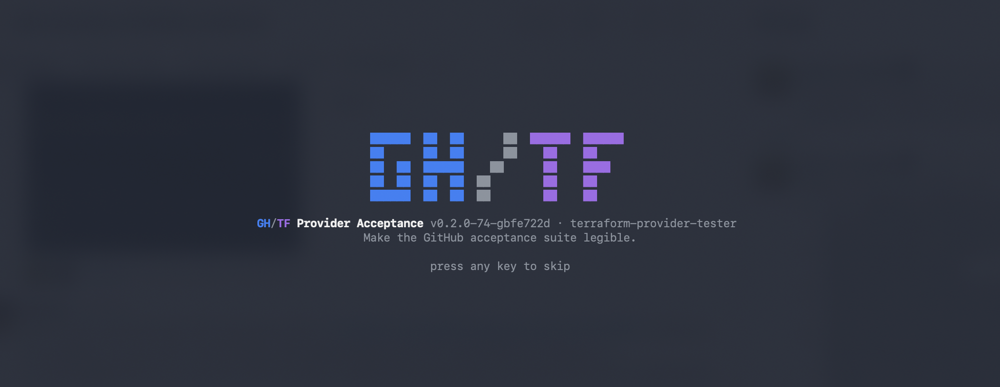
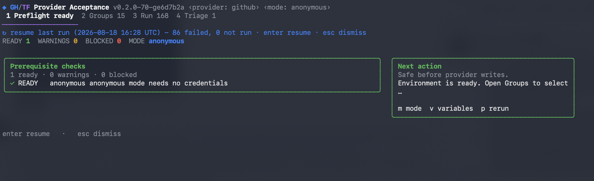
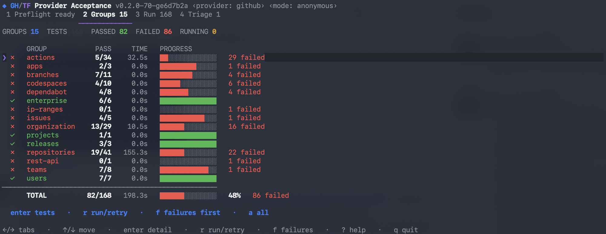
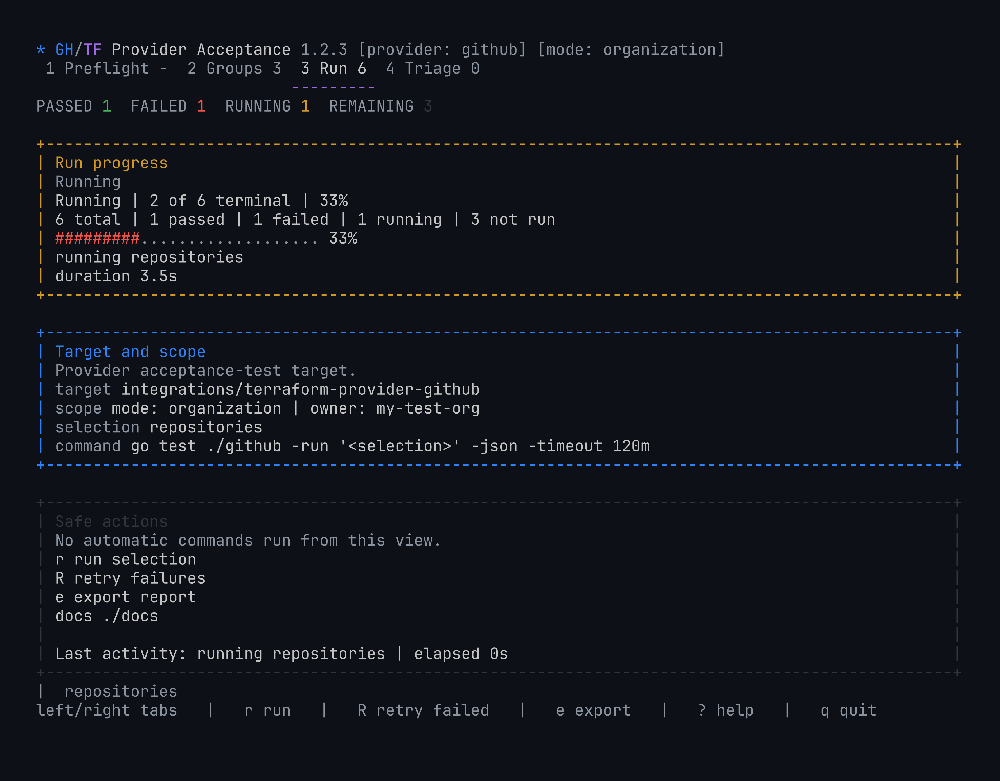
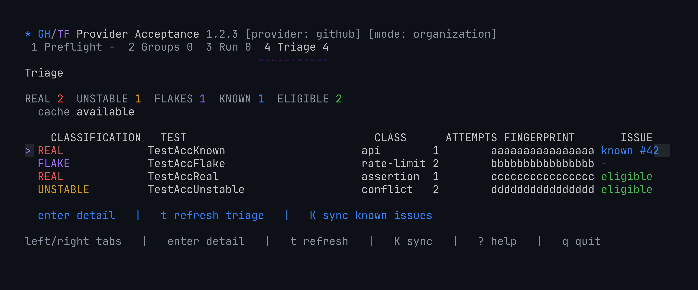

# Terraform Provider Tester

Terraform Provider Tester wraps the existing
[`integrations/terraform-provider-github`](https://github.com/integrations/terraform-provider-github)
acceptance suite. It adds plan-aware preflight, grouped execution, NDJSON
output, selective retry and resume, failure triage, reports, and guarded
cleanup without rewriting the provider's tests.

Acceptance tests call real GitHub APIs. Credentialed modes can create and
delete resources, so start with the anonymous smoke test.

> [!NOTE]
> This is an AI-assisted internal tool. A human must understand and validate
> its output before using it to propose provider changes.

## Try it safely

Build the private tester, clone the provider, and run the public IP-ranges
acceptance test:

```sh
gh repo clone github/terraform-provider-tester ~/.local/share/terraform-provider-tester -- --depth 1
make -C ~/.local/share/terraform-provider-tester build

git clone https://github.com/integrations/terraform-provider-github
cd terraform-provider-github

~/.local/share/terraform-provider-tester/bin/terraform-provider-tester \
  preflight --mode anonymous --json

~/.local/share/terraform-provider-tester/bin/terraform-provider-tester \
  run --mode anonymous \
  --run '^TestAccGithubIpRangesDataSource$' \
  --json
```

Anonymous mode needs no PAT or organization and creates no GitHub resources.
Use the final `summary` event and process exit code as the result.

## Guided E2E workflow

The `e2e` command plans the eligible tests for one mode, runs preflight,
executes the suite, retries failed tests once, triages remaining failures, and
checks for orphaned resources.

```sh
terraform-provider-tester e2e --mode individual --json
terraform-provider-tester e2e --mode organization --json
```

Individual mode needs no dedicated organization, but it still requires
`GITHUB_OWNER`, `GITHUB_USERNAME`, authentication, and
`GH_TEST_ORG_TEMPLATE_REPOSITORY`. See the prerequisites reference for the
complete scopes and GitHub App alternatives.

Preflight fails closed when required configuration or permissions are missing.
Guided runs do not run cleanup automatically. See
[`docs/prerequisites.md`](docs/prerequisites.md) before using a credentialed
mode.

Credentialed text and NDJSON output distinguish baseline, final, pre-existing,
and new resources. Only `New` is this run's cleanup obligation. The
`orphan_delta` event appears only for credentialed runs, and preview or cleanup
commands appear only when cleanup status supports an attributed delta. In
`baseline-only` output, zero final values are unmeasured placeholders;
`cleanup_status` is authoritative. Anonymous mode emits no `orphan_delta` or cleanup command.

## Copilot and reviewer validation

The repository's bundled skill provides the validated portable bootstrap and
one-time personal-skill setup for Copilot. It lives at
[`terraform-provider-tester` Copilot skill](.github/skills/terraform-provider-tester/SKILL.md)
and also documents safety rules, command mapping, retry policy, and NDJSON
interpretation.

```sh
copilot skill add ~/.local/share/terraform-provider-tester/.github/skills/terraform-provider-tester/SKILL.md
```

Pull request reviewers can point Copilot directly at
[`docs/reviewer-validation.md`](docs/reviewer-validation.md). The packet:

- creates disposable tester and provider checkouts;
- unsets GitHub credentials for the actual test commands;
- runs anonymous preflight and one real acceptance test;
- checks the final NDJSON summaries with `jq`; and
- refuses to report success unless every assertion passes.

## NDJSON contract

Automation should consume the last `summary` event and the process exit code.
The stream can also include:

- `plan`: selected, eligible, excluded, and unclassified counts;
- `excluded`: one test rejected by the current mode or requirements;
- `check` or `capability`: one preflight result;
- `group` and `test`: discovery and execution results; and
- `orphan_delta`: credentialed logical-run resource accounting.

## GH/TF Provider Acceptance console

The optional human console has four tabs: Preflight, Groups, Run, and Triage.
The CLI and NDJSON remain the automation interfaces.

```sh
terraform-provider-tester run \
  --mode anonymous \
  --run '^TestAccGithubIpRangesDataSource$' \
  --tui
```

Use Left/Right, Tab/Shift+Tab, or `1` through `4` to switch tabs. Press `?` for
help and `q` to quit. Report, triage, issue, orphan, and sweep actions are
guarded and run one at a time.

**Ignition splash**



**Preflight**



**Groups**



**Run**



**Triage**



The screenshots are rendered from the console's own synthetic views, so they
carry placeholder identities and never real account data or credentials.

## Safety

- Secrets are redacted from state, reports, failure logs, JSON, and dashboard
  errors.
- `TF_LOG*` is not forwarded unless `--allow-sensitive-logs` is explicit.
- Test selections are process arguments, not shell commands.
- `orphans` is read-only.
- `sweep` requires explicit confirmation and deletes only prefixed acceptance
  resources.
- Issue filing requires explicit filing and confirmation flags and performs
  live known-issue and duplicate checks first.

Cleanup commands resolve cleanup mode from `--mode` first, then the persisted
plan or run state. They fail instead of guessing when no cleanup mode is known.

The state and environment compatibility names remain `.pulsar-state.json`,
`.pulsar-failures/`, `.pulsar.env`, and `PULSAR_*`.

## Documentation

- [Quickstart](docs/quickstart.md)
- [CLI reference](docs/cli-reference.md)
- [Prerequisites](docs/prerequisites.md)
- [Test modes](docs/test-modes.md)
- [Environment variables](docs/environment-variables.md)
- [CI integration](docs/ci.md)
- [Architecture](docs/architecture.md)
- [Troubleshooting](docs/troubleshooting.md)
- [Private validation](docs/private-validation.md)
- [Reviewer validation packet](docs/reviewer-validation.md)

## Development

```sh
make test vet checkdocs build
```

The repository is owned by GitHub, Inc. and distributed under the
[MIT License](LICENSE). Maintainers are listed in [MAINTAINERS.md](MAINTAINERS.md).
