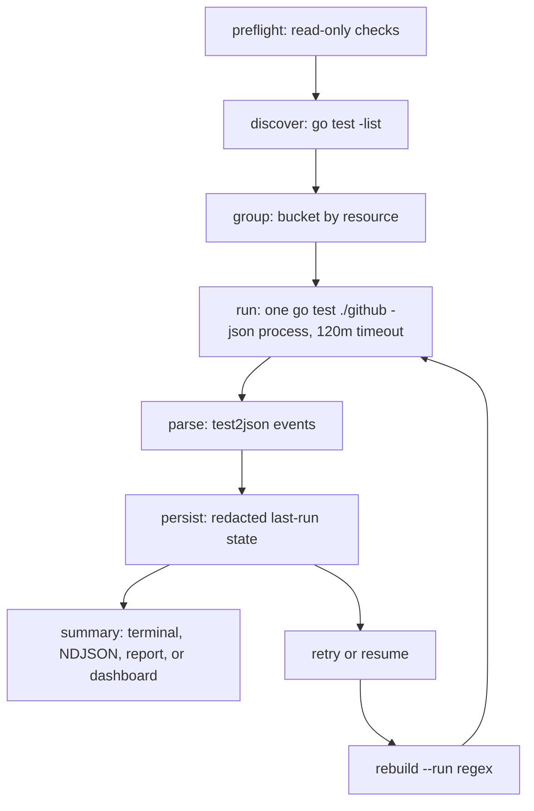

# Architecture

`terraform-provider-tester` is a separate Go module that shells out to the `go` toolchain. It wraps the provider's existing acceptance-test flow; it does not import the provider, modify the provider, or rewrite its tests. Because the harness lives behind its own module boundary, `go test ./...` from the repository root does not descend into it. For a user-facing overview, see [About terraform-provider-tester](./index.md). For command details, see [terraform-provider-tester CLI reference](./cli-reference.md).

## Layers

`terraform-provider-tester` keeps provider-neutral test execution separate from GitHub-specific rules. The engine is the headless, testable core. It sits behind a provider interface, so it can discover tests, group them, run a child process, parse results, persist state, and render reports without knowing which GitHub credentials or cleanup rules apply.

The `engine/` package owns that core. `parse.go` parses `go test -json` events. `discover.go` lists tests with `go test -list`. `group.go` buckets tests into groups. `run.go` runs one `go test -json` subprocess. `state.go` manages last-run state persistence and locking. `report.go` exports HTML, Markdown, and terminal summaries, including planning, retry, and orphan-accounting counts from state.

The `provider/` and `provider/github/` packages adapt the core to this repository. `env.go` defines modes and environment variables. `preflight.go` performs read-only validation before any test run. `token.go` validates PATs. `sweep.go` finds or deletes orphaned `tf-acc-test-*` resources. `group.go` contains GitHub resource grouping rules.

The `cli/` package is the command boundary. `cli.go` dispatches subcommands, emits text or NDJSON, and `dashboard.go` wires the optional dashboard into the command flow. The dashboard producer owns every side effect: subprocesses, filesystem access, known-issue sync, report export, orphan listing, sweep, and issue filing. `main.go` only calls `cli.Run`, so the executable entrypoint stays thin.

The `tui/` package contains the optional Bubble Tea dashboard reducer and views: model, update, view, spinner, and styles. It stays pure. It does not touch the filesystem, call the network, or read credentials directly. It renders the four-tab shell, tracks selection state, and emits intents. `dashboard.go` receives those intents, routes them through shared CLI services, and sends the results back as messages. The `internal/redact/` package masks known secrets and credential-shaped strings before messages reach persisted artifacts, reports, JSON output, triage output, or the dashboard.

### Dashboard layout

The dashboard derives all metrics, tab badges, and panels from the in-memory model. Views stay pure: rendering does not read files, read environment variables, call GitHub, or mutate state. The reducer updates the model, and the CLI bridge performs side effects.

The layout uses three breakpoints:

- `layoutCompact <72` columns: abbreviated chrome, stacked panels, and compact labels.
- `layoutStandard 72-109` columns: full tab labels, metric strips, and stacked mission-control panels.
- `layoutWide >=110` columns: full header context and side-by-side mission-control panels where the view has room.

Preflight, Groups, Run, and Triage share the same panel primitives. Metric strips summarize current state, panels group related actions, and the footer shows only keys that apply to the active view or overlay.

## Data flow

A run starts with preflight. Preflight is read-only: it checks the selected mode, required environment, token behavior, and rate-limit headroom before the provider's `TestMain` can exit with little context.

After preflight, discovery lists acceptance tests with `go test -list`, and grouping buckets discovered names by GitHub resource. The runner then starts one `go test ./github -json` process with a 120m timeout. `terraform-provider-tester` does not start one process per group; it slices the event stream into grouped summaries while the single child process runs.

The parser reads the `test2json` event stream and turns package, test, subtest, status, and elapsed-time events into result records. The engine persists a redacted last-run state, then builds the terminal, NDJSON, report, or dashboard summary from that state. The same persisted state powers cache-only dashboard triage refreshes, report export, selected issue preview, and guarded cleanup.

`retry` and `resume` reverse the flow from state. They read the last-run file, select only failed tests or failed plus not-yet-run tests, and rebuild a `--run` regex for the next child process. They do not need raw output because state stores the structured result data needed to choose tests.

Credentialed guided runs add orphan accounting around execution under the same state lock. The baseline read is non-destructive, and failure stops the run before tests start. The harness persists that baseline once. Only guided `e2e` installs the graceful signal handler. A graceful first interruption of guided `e2e` can persist partial results, the execution plan, and final orphan accounting before returning. When that save succeeds, `resume` reuses the original baseline instead of taking a new snapshot. SIGKILL, or interruption of `run`, `retry`, or `resume` outside that guided signal path, may leave no resumable plan. If the plan is missing, start a new run or e2e workflow to establish fresh state. After every attempted credentialed run or resume, a cancellation-independent 30-second final check partitions final resources into `PreExisting` and `New` by kind and name. A failed final check records `unknown` and makes the command fail. No guided path calls `sweep`.

## State and concurrency

`terraform-provider-tester` writes `.pulsar-state.json` at the provider repository root. It also uses `.pulsar-state.json.lock` at the same root. The lock refuses concurrent harness runs, so two sessions cannot read or write the last-run state at the same time. The dashboard reuses that same lock before it refreshes triage, exports a report, or files an issue, so it always reloads authoritative state before it mutates anything. The lock file records its owner so that a lock left by a crashed run is reclaimed automatically on the next run when its owner is gone; `terraform-provider-tester unlock` clears any lock the automatic reclaim leaves in place.

The state file contains structured results, not logs. Each result stores only `test`, optional `sub`, `status`, `elapsed`, and `package`. The top-level state stores `provider`, `mode`, `run_at`, `history`, and, since state version 2, an optional `plan` (the resolved `ExecutionPlan`: selected, eligible, excluded, and unclassified tests, plus aggregated scopes, capabilities, and side effects). State version 2 also accepts optional `orphans` fields for mode, baseline, final, pre-existing, new, capture markers, and cleanup status; adding them does not require a version 3 migration. It never stores raw output or secrets. Secret redaction also applies to orphan metadata, persisted artifacts, reports, JSON output, and dashboard messages.

A `.pulsar-state.json` written before state version 2 has no `plan` field. Loading it does not synthesize a plan: `Plan` stays `nil`, and `terraform-provider-tester report` falls back to legacy totals plus the literal note `legacy state: planning counts unavailable` instead of guessing at planning or retry counts it cannot verify. State with no orphan object remains valid; state-aware reports say `orphan accounting unavailable` rather than inventing zero counts. `retry` and `resume` require a persisted plan and reject a planless state outright, so the next `run` or `e2e` writes fresh state with `plan` populated.

This small state shape makes resume predictable. `retry --failed` can select failed top-level tests from the prior run, and `resume` can select failed plus not-yet-run tests, without replaying the previous output stream. Triage adds safe failure metadata to state: fingerprint, class, canonical reason, retryability, classification, attempts, and log path. It never stores raw output.

The dashboard also keeps a single-operation gate in memory. That gate prevents overlapping runs, exports, known-issue syncs, orphan scans, sweeps, and issue filing. A human can queue the next action only after the current one finishes or fails.

Artifacts at the provider repository root:

- `.pulsar-state.json` - structured last-run state, redacted, gitignored.
- `.pulsar-state.json.lock` - concurrency lock for state updates, gitignored.
- `.pulsar-failures/` - redacted per-failure logs, gitignored. Runs refresh logs for top-level tests they re-run and preserve logs for failures they did not re-run, matching the cumulative status in `report`; a full passing run clears them.

Artifacts under `<user-config-dir>/terraform-provider-tester/`:

- `known-issues.yaml` - the optional local cache for live known-issue sync.
- `reports/<UTC timestamp>-report.md` and `reports/<UTC timestamp>-report.html` - persistent report exports.

Known-issue sync and report export both write private temp files in the destination directory and rename them into place. The directories are created with private permissions. Report export refuses to overwrite an existing same-second pair, so an earlier export stays intact. The legacy `.pulsar-state.json`, `.pulsar-state.json.lock`, `.pulsar-failures/`, and `.pulsar.env` names remain in place for repo-local compatibility.

## Why a separate module

The module boundary protects the provider's dependency graph. The optional dashboard depends on Charmbracelet packages for the Bubble Tea TUI. Those dependencies are useful for the harness, but they must not enter the Terraform provider module or affect provider builds, tests, or releases.

Keeping `terraform-provider-tester` in a separate module also keeps responsibilities clear. The provider remains the system under test. The harness remains a wrapper around the provider's `go test` acceptance flow.
