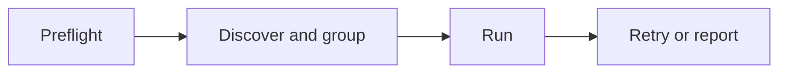

# About Terraform Provider Tester

## Why Terraform Provider Tester exists

**Terraform Provider Tester** is the acceptance-test harness for this provider; you invoke it with the **`terraform-provider-tester`** command. It wraps the provider's existing `go test` acceptance flow, so you can run and inspect that flow without rewriting or replacing any test.

A full acceptance run takes around 90 minutes and drives real GitHub resources. Without the harness, failures are hard to see because you get one sequential `go test` run over a 120-minute window, raw logs, no per-group summary, and no resume path. A misconfigured run can also die with a cryptic `os.Exit(1)` and no per-test detail.

## Primary workflow

Terraform provider acceptance tests exercise provider behavior against real GitHub APIs and may create and delete resources. Use the guided command with `--json` for Copilot, CI, and other automation. Start with individual mode - the lowest-setup credentialed mode, because it needs no dedicated organization:

```shell
terraform-provider-tester e2e --mode individual --json
```

Individual mode is not zero-setup. It needs `GITHUB_OWNER`, `GITHUB_USERNAME`, one auth method, and `GH_TEST_ORG_TEMPLATE_REPOSITORY` naming a template repository owned by `GITHUB_OWNER`; a classic PAT needs `repo`, `delete_repo`, `user`, `admin:public_key`, `admin:gpg_key`, and `codespace`. See [Prerequisites](./prerequisites.md).

`--mode` defaults to `organization` when omitted, so `terraform-provider-tester e2e --json` runs the organization workflow with a disposable organization configured.

The command runs preflight for the selected mode first, retries only failed tests once, and triages remaining failures without rerunning. For a credentialed mode, the command captures one read-only orphan baseline and performs a final orphan check after an attempted run. If interrupted, `resume` keeps the original baseline and attributes only resources absent from that baseline to the logical run. Credentialed JSON emits an `orphan_delta` event before the final `e2e` summary. Exact commands appear only when cleanup status supports an attributed delta; status `unknown` suppresses them. In `baseline-only` JSON, zero `final` and `pre_existing` values are unmeasured placeholders, and `cleanup_status` is authoritative. Anonymous mode emits no `orphan_delta` or cleanup command. No cleanup runs automatically.

The TUI stays optional. Its human-facing identity is **GH/TF Provider Acceptance**; the command remains `terraform-provider-tester`. The tabs are Preflight, Groups, Run, and Triage. The dashboard runs one action at a time and can refresh cached triage, sync known issues live, preview a selected issue, export reports, preview orphaned resources, confirm a sweep, and flip between failures-first and all-group views. See the [README dashboard gallery](../README.md#optional-interactive-dashboard) for screenshots and keys.

## What terraform-provider-tester does

For command details, see [terraform-provider-tester CLI reference](./cli-reference.md).

- **Preflight** validates the selected mode and required environment before `go test` runs.
- **E2E** runs the guided workflow, from preflight through orphan reporting, for one mode at a time (individual or organization, most commonly).
- **Groups** organize `TestAccGithub*` tests by resource for per-group summaries.
- **Run** starts selected acceptance tests, with text streaming or NDJSON for automation.
- **Retry and resume** re-run prior failures or failed and not-yet-run tests from the last run.
- **Triage** fingerprints failures, classifies flakes, and prints safe JSON without raw output.
- **Report** exports or prints test, planning, retry, and orphan-accounting summaries from persisted state.
- **Orphans and sweep** list leaked `tf-acc-test-*` resources or delete them only after explicit confirmation.
- **Optional interactive dashboard** presents the Preflight, Groups, Run, and Triage tabs for humans while the CLI remains the primary interface.



## How it fits the provider's test flow

`terraform-provider-tester` sits in front of the provider's acceptance test flow. It wraps `go test ./github -json`, slices the stream into groups, and stores a redacted last-run state so later commands can report, retry, resume, or triage without parsing raw logs.

The state lives in `.pulsar-state.json` at the provider repo root. It contains test names, status, mode, timestamps, package data, and history, but never raw output or secrets. A `.pulsar-state.json.lock` file refuses concurrent harness runs. For more information, see [Architecture](./architecture.md).

## What terraform-provider-tester is not

`terraform-provider-tester` does not rewrite or replace the provider's tests. The same acceptance tests still run, and the harness does not make the GitHub API work faster.

`terraform-provider-tester` is also an AI-assisted tool built in a fork. It is not an upstream contribution. Respect the provider's AI Use Policy, and do not open an upstream pull request from this work without human understanding and testing first.

## Next steps

To try the harness, see [Quickstart for terraform-provider-tester](./quickstart.md). Pull request reviewers can give Copilot the [reviewer validation packet](./reviewer-validation.md) for a disposable anonymous run with machine-checked output. To prepare credentials and modes before a credentialed run, see [Prerequisites](./prerequisites.md). To validate a real push privately on infrastructure you own, see the [Private validation runbook](./private-validation.md). To call the guided workflow from a pipeline, see [CI integration](./ci.md).
